# Ticket Resolution Flow

This document illustrates the complete flow of ticket creation, AI-powered analysis, and change application in the Agentic-AI Self-Healing Service.

## System Components

| Component | Description | Color |
|-----------|-------------|-------|
| Agentic-AI Service | Self-healing service (this project) | Blue |
| Claude Server | Anthropic's Claude API | Purple |
| Target Project | E-commerce project being analyzed | Green |

---

## Flow Diagram

---

## Detailed Step-by-Step Flow

### Phase 1: Ticket Creation

| Step | Component | Route/Method | Description |
|------|-----------|--------------|-------------|
| 1 | Frontend | `POST /api/tickets` | User creates ticket with title, category, description |
| 2 | Agentic-AI | `db.create_ticket()` | Ticket stored in SQLite database |

### Phase 2: AI Analysis (Two-Step Process)

| Step | Component | Route/Method | Description |
|------|-----------|--------------|-------------|
| 3 | Frontend | `POST /api/tickets/{id}/ai-resolve` | Trigger AI resolution |
| 4-6 | Agentic-AI → Target | `GET /api/blueprint_json` | Fetch API structure from target |
| 7-9 | Agentic-AI → Target | `get_all_files_recursive()` | Get list of all source files |
| 10-11 | Agentic-AI → Claude | `identify_relevant_files()` | **Step 1**: Ask Claude which files are relevant (lightweight) |
| 12-14 | Agentic-AI → Target | `read_file()` | Read only the relevant files |
| 15-17 | Agentic-AI → Claude | `process_task_two_step()` | **Step 2**: Send task + blueprint + files for analysis |
| 18-19 | Agentic-AI → Claude | `propose_file_change()` | Generate proposed code changes |
| 20 | Agentic-AI | `db.update_ticket_ai_suggestion()` | Store suggestion and proposed changes |

### Phase 3: User Decision

| Step | Component | Route/Method | Description |
|------|-----------|--------------|-------------|
| 21 | Frontend | `POST /api/tickets/{id}/ai-action` | User submits decision |

#### If Accept:
| Step | Component | Route/Method | Description |
|------|-----------|--------------|-------------|
| 22-23 | Agentic-AI → Target | `apply_proposed_change()` | Write modified files to target project |

#### If Reject:
| Step | Component | Route/Method | Description |
|------|-----------|--------------|-------------|
| 24 | Agentic-AI | `reject_proposed_change()` | Mark changes as rejected in DB |

#### If Probe:
| Step | Component | Route/Method | Description |
|------|-----------|--------------|-------------|
| 25-26 | Agentic-AI → Claude | `chat()` | Send follow-up question for more insights |

---

## Token Efficiency Points

```mermaid
flowchart LR
    subgraph Efficient["✅ Efficient Techniques Used"]
        style Efficient fill:#e8f5e9,stroke:#388e3c
        E1["Blueprint endpoint<br/>instead of parsing files"]
        E2["Two-step file selection<br/>lightweight first call"]
        E3["Read only relevant files<br/>not entire codebase"]
        E4["Structured context<br/>formatted API info"]
    end

    subgraph Avoided["❌ What We Avoid"]
        style Avoided fill:#ffebee,stroke:#c62828
        X1["Sending all files"]
        X2["Parsing route files"]
        X3["Including node_modules"]
        X4["Raw JSON dumps"]
    end
```

---

## API Routes Summary

| Route | Method | Purpose |
|-------|--------|---------|
| `/api/tickets` | POST | Create new ticket |
| `/api/tickets` | GET | List all tickets |
| `/api/tickets/{id}` | GET | Get ticket details |
| `/api/tickets/{id}/ai-resolve` | POST | Trigger AI analysis |
| `/api/tickets/{id}/ai-action` | POST | Accept/Reject/Probe |
| `/api/tickets/{id}/chat` | POST | Chat about specific ticket |
| `/api/tickets/{id}/proposed-changes` | GET | View proposed changes |
| `/api/proposed-changes/{id}/accept` | POST | Apply a proposed change |
| `/api/proposed-changes/{id}/reject` | POST | Reject a proposed change |
| `/api/target/blueprint` | GET | Proxy to target's blueprint |
| `/api/target/ai-context` | GET | View formatted AI context |
